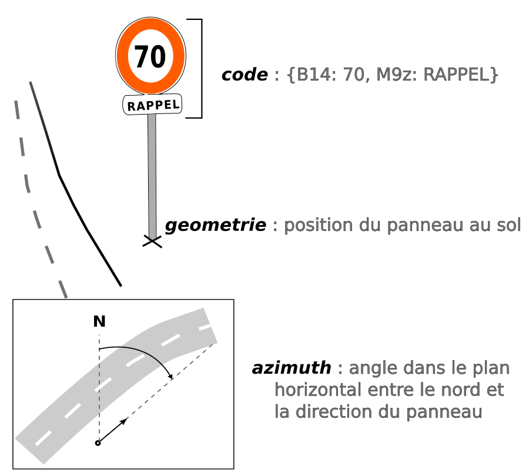

# PANO  
## Contexte  

L'objectif est de proposer de discuter autour d'un modèle commun national pour les données panneaux. Ce format pivot vise à :
* permettre l'aggrégation des différentes productions
* permettre l'amélioration des différents référentiels routiers
* faciliter les croisements de données

## Standard de données

Le standard choisi est [`TableSchema`](https://specs.frictionlessdata.io/table-schema/) car il est utilisé sur https://schema.data.gouv.fr.

## Description du modèle

Les principales propriétés qui permettent de modéliser un panneau sont les suivantes :
* une géométrie ponctuelle qui représente sa position
* un code qui contient son type selon la [codification officielle](https://equipementsdelaroute.cerema.fr/versions-consolidees-des-9-parties-de-l-a528.html) et l'inscription qu'il porte, ainsi que ses éventuels panonceaux
* un angle qui donne son orientation  
  
  

La description du modèle complet en markdown se trouve ici : [pano.schema.md](doc/pano.schema.md).

## Rattachement d'un panneau à un référentiel routier

Le modèle prévoit que les panneaux soient rattachés à un référentiel routier afin de répondre à des cas d'usage intéressants comme le calcul des vitesses maximales autorisées. La propriété `rattachements` contient un objet dont le modèle est décrit ici : [pano.rattachements.schema.md](doc/pano.rattachements.schema.md).  
La référence choisie ici est la `BDTopo®` mais le modèle est extensible, afin de permettre de référencer d'autres réseaux routiers.

## Jeu de données valide

* [Jeu de données en CSV](pano.dataset.valide.csv)  
* [Jeu de données en GeoJSON](pano.dataset.valide.geojson)

## Diffusion via BDTopo® (IGN)

L'IGN prévoit de diffuser des données panneaux via leur intégration à la `BDTopo®`.

## Pour aller plus loin

* [détails sur la codification d'un panneau](doc/pano.codification.md)
* [détails sur le principe de rattachement d'un panneau à un référentiel routier](doc/pano.rattachements.md)
* [proposition d'extensions au modèle éventuellement utiles mais discutables](doc/pano.extensions.schema.md)
* [détails sur la problématique de complétude des panneaux d'agglomération](doc/pano.agglomerations.md)

## Liens
* [Liste des panneaux avec fichiers SVG](https://commons.wikimedia.org/wiki/Category:SVG_road_signs_in_France)
