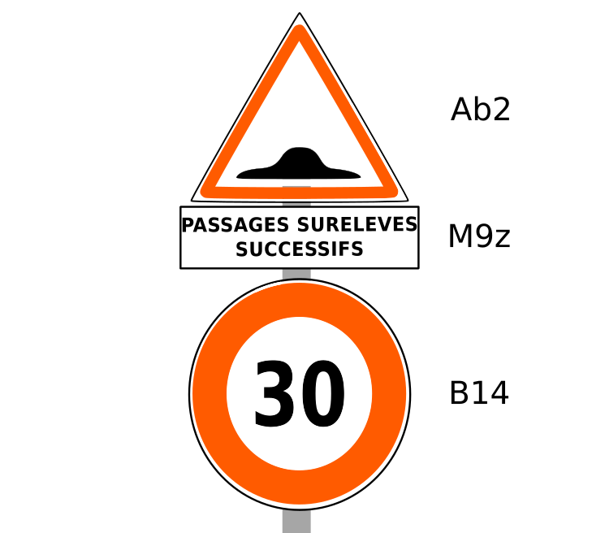

# Codification d'un panneau

Le type et l'inscription d'un panneau sont donnés dans le champ `code`. Le détail du modèle se présente comme suit :



On a ici :
* un panneau de danger (code `Ab2`)
* un panonceau (code `M9z`) qui doit être associé au panneau `Ab2`
* un panneau de limitation de vitesse (code `B14`)

Tous ces panneaux partagent le même support mais il conviendra de produire deux objets distincts dont les valeurs de `code` seront :
 
```json
"code" : {"A2b": "", "M9z": "Passages surélevés successifs"}
"code" : {"B14": 30}
```

Un panneau désigne en fait un ensemble dans lequel peuvent coexister :
* un panneau
* un ou plusieurs panonceaux  

