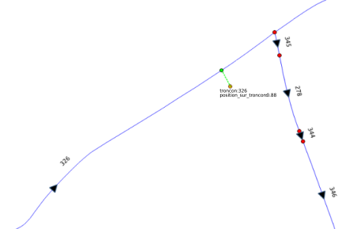
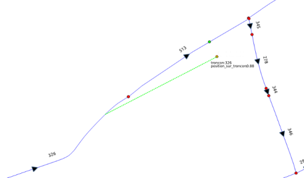
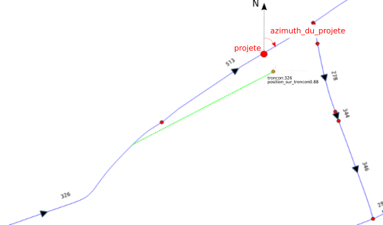

# Rattachement d'un panneau à un réseau routier

## Contexte

Des usages incontournables des données panneaux nécessitent de rattacher ces dernières à un réseau routier. On peut citer le besoin de calculer une base des vitesses maximales autorisées par exemple.  
Ce rattachement s'effectue par `référencement linéaire`. Or il n'est pas trivial de maintenir dans le temps une référence aux tronçons de route par leur identifiant.  
Il convient donc de prévoir un mécanisme de mise à jour. Pour ce faire, il est proposer de s'appuyer sur un raisonnement géométrique en cherchant à stocker __des invariants qui permettront un recalcul de la référence.__

## Utilisation du principe de référencement linéaire

Dans le modèle de rattachement proposé, les panneaux référencent les tronçons de route via les propriétés suivantes :  
* `troncon` : identifiant du tronçon de route auquel on souhaite rattacher le panneau
* `position_sur_troncon` : position du panneau sur le tronçon indiquée par une valeur relative comprise entre 0 (extrémité initiale du tronçon) et 1 (extrémité finale du tronçon) afin de permettre une `segmentation dynamique` du réseau.
* `sens` : sens d'application de la directive donnée par le panneau par rapport au sens de numérisation du tronçon.  
  

## Problématique de maintien dans le temps du rattachement aux réseaux routiers

En cas de mise à jour du réseau routier, ces informations peuvent ne plus être valables.    
Par exemple, une opération de scission du tronçon de route numéro 326 provoque un déplacement du projeté :  
  

De plus, le calcul du projeté d'un panneau ne se limite pas à une simple projection de la géométrie du panneau sur le point le plus proche du réseau. Ce calcul peut donner lieu à la mise en oeuvre d'une logique plus complexe comme la recherche de la prochaine bretelle dans le cas d'un panneau de sortie mais néanmoins situé géométriquement le long d'un tronçon d'autoroute. Il est donc important de ne pas perdre ce travail de rattachement.  

Pour permettre un recalcul de ces informations, il est proposé d'enregistrer les invariants suivants :  
* `projete` : position du projeté du panneau sur le tronçon de route de rattachement
* `azimuth_du_projete` : orientation du tronçon de route de rattachement au niveau du projeté du panneau dans le sens de circulation concerné par ce panneau

  

En effet, même si `projete` et `azimuth_du_projete` doivent être mis à jour en cas de modification du __tracé__ du réseau au niveau du projeté du panneau, ces informations permettent le recalcul des trois premières indépendamment de la nature des modifications opérées sur le réseau routier (fusion, scission, modification de propriété, modification d'une autre partie de la géométrie...).

## Extensibilité du modèle

Le modèle prévoit de permettre de référencer plusieurs réseaux routiers via l'ajout d'un prefixe au nom des champs cités plus haut. Par exemple :  
* `osm_troncon`
* `osm_position_sur_troncon`
* `osm_sens`
* `osm_projete`
* `osm_azimuth_du_projete`
* `osm_version`
* `osm_actualite`