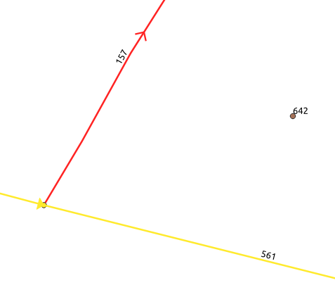
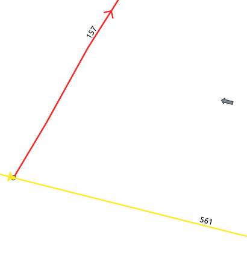

# Expérimentation de passage d'un jeu de données dans le modèle cible

## Données en entrée

Le [jeu de données](../data/pano.dataset.source.csv) est issu de données saisies sur la commune de Vauréal (95).
* format : csv
* stats : 1015 objets (panneaux) de différents types

## Passage au modèle cible

Le script [`create_valid_dataset.sh`](create_valid_dataset.sh) permet d'obtenir ces données dans le format cible.
Les pré-requis au lancement de ce script sont les suivants : 
* avoir créé une base postgresql / postgis intitulée `pano`
* avoir intégré la table `troncon_de_route` de la BDTopo dans cette base (schéma public)
* renseigner les variables d'environnements qui seront utilisées par le script : 
    * PGHOST
    * PGPORT
    * PGUSER
    * PGPASSWORD

## Résultats

Les données sont exportées par le script au format CSV : 
* pano_valide_complet.csv : fichier contenant les panneaux dans le modèle cible (résultat produit)
* troncon_de_route_filtre.csv : fichiers des routes carrossables sur Vauréal (référentiel)
* rattachements : table de lien entre les routes et les panneaux valides. C'est le contenu du champ `rattachements` de `pano_valid_complet` sous forme de table utilisé comme intermédiaire de calcul (exporté pour debug et visualisation dans QGIS)

## Etapes de transformation du modèle

| étape                                         | original                                             | cible                                                                                                                                                     |
|-----------------------------------------------|------------------------------------------------------|-----------------------------------------------------------------------------------------------------------------------------------------------------------|
| codification du panneau                       | contenue dans plusieurs champs `Type_1`,...,`Type_7` | contenue en json dans le champ `code`{code:valeur,...}                                                                                                    |
| rattachement à un tronçon de route            | référence au tronçon absente                         | récupération du tronçon de route de la BDTopo le plus proche du panneau et lorsque le panneau est à droite de la route par rapport au sens de circulation |
| position du projeté du panneau sur le tronçon | référence au tronçon absente                         | interpolation linéaire sur le tronçon                                                                                                                     |
| sens du panneau par rapport au tronçon        | champ absent                                         | calcul du sens du panneau à droite par rapport au sens de numérisation du tronçon                                                                         |
| calcul de la géométrie du projeté             | champ absent                                         | géométrie du point le plus proche sur le tronçon                                                                                                          |
| calcul de l'azimuth au projeté                | champ absent                                         | azimuth du segment le plus proche                                                                                                                         |
| azimuth du panneau'                           | champ absent                                         | arbitrairement rempli avec la valeur de l'azimuth du projeté pour présenter un jeu de données idéal complet                                               |
| champs `producteur` et `commentaire`          | absents                                              | ajout et remplissage par des valeurs arbitraires                                                                                                          |

## Analyse des résultats

### Mode opératoire

Le projet QGIS [`vue_resultats.qgz`](vue_resultats.qgz) permet d'analyser visuellement les données.

### Difficultés et intérêt de produire les données les champs du modèle décrit ici

#### Orientation du panneau (azimuth)

Lorsque la donnée panneau se limite à un ponctuel, on éprouve des difficultés à la rattacher avec fiabilité à un réseau routier :  
  
Le panneau `642` s'applique t-il le long du tronçon de route `157` ou `561` ?

Dans ce cas, l'azimuth s'il est fourni peut lever l'ambigüité :  
  
L'orientation du panneau si elle est fournie permettra de rattacher avec plus de certitude le panneau au tronçon `561`

Ici, en l'absence de connaissance de l'orientation, c'est l'hypothèse qu'un panneau est situé à droite de la route qu'il concerne selon le sens de circulation qui a primé. Cette hypothèse provoque des erreurs de rattachement dans certains cas.

#### Qualificatifs de route

D'autres informations caractérisant la route peuvent être utiles comme le nom de la rue ou la nature de la route __sur laquelle s'applique l'information portée par le panneau__. Par exemple, l'information que le panneau concerne une bretelle de sortie permet d'éviter de le rattacher à une autoroute.

Ici en l'absence de ces informations, c'est le tronçon le plus proche dont le panneau se trouve à droite qui est choisi ce qui n'est pas toujours le cas.